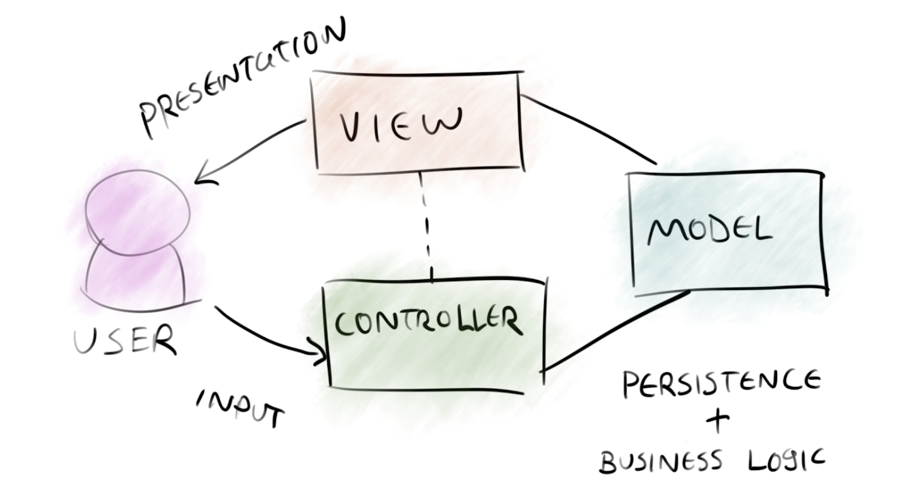

# CÁC NGUYÊN TẮC THIẾT KẾ, MÔ HÌNH THIẾT KẾ

## 1.SOLID là gì?
SOLID là viết tắt của 5 chữ cái đầu trong 5 nguyên tắc thiết kế hướng đối tượng. Giúp cho lập trình viên viết ra những đoạn code dễ đọc, dễ hiểu, dễ maintain. Nó được đưa ra bởi Robert C. Martin và Michael Feathers. 5 nguyên tắc đó bao gồm:

**S**ingle responsibility principle (SRP)
**O**pen/Closed principle (OCP)
**L**iskov substitution principe (LSP)
**I**nterface segregation principle (ISP)
**D**ependency inversion principle (DIP)

#### 1.1 SRP - Single responsibility principle 
``Mỗi lớp chỉ nên chịu trách nhiệm về một nhiệm vụ cụ thể nào đó mà thôi.``

Một class chỉ nên giữ một trách nhiệm duy nhất. Một class có quá nhiều chức năng sẽ trở nên cồng kềnh và trở nên khó đọc, khó maintain. Việc thay đổi, cần thêm sửa chức năng là rất bình thường, nên việc code trong sáng, dễ đọc dễ hiểu là rất cần thiết.

Ví dụ với bài toán: một công ty có các chức vụ: Dev, Tester, Sales.
Nếu ta tạo 1 class Employee với 3 phương thức devFunc(), testerFunc(), salesFunc() sẽ làm cho class Employee cồng kềnh, rối rắm, khó bảo trì, nếu cần thêm 10 chức vụ nữa thì điều này sẽ càng rõ ràng hơn, và khi đó Dev hay Tester hay Sales sẽ có chức năng giống như các chức vụ còn lại, điều này là dư thừa, không cần thiết.

Do đó áp dụng nguyên tắc Mỗi lớp chỉ chịu trách nhiệm 1 phần cụ thể nào đó, ta tạo 1 class Employee có các thuộc tính chung giữa các chức vụ, 1 phương thức là working(), sau đó tạo các class chức vụ thừa kế lại class Employee vừa rồi, khi cần sửa / thêm chức vụ nào chỉ cần quan tâm đến đứng class đó.

#### 1.2 OCP - Open / Close principle
``Không được sửa đổi một Class có sẵn, nhưng có thể mở rộng bằng kế thừa.``

Theo nguyên lý này, mỗi khi ta muốn thêm chức năng cho chương trình, chúng ta nên viết class mới mở rộng class cũ (bằng cách kế thừa hoặc sở hữu class cũ) chứ không nên sửa đổi class cũ. Việc này dẫn đến tình trạng phát sinh nhiều class, nhưng chúng ta sẽ không cần phải test lại các class cũ nữa, mà chỉ tập trung vào test các class mới, nơi chứa các chức năng mới.

Ví dụ: ban đầu ta có 1 lớp đảm nhiệm việc kết nối đến CSDL:
```Java
class ConnectionManager
{
    public function doConnection(Object $connection)
    {
        if($connection instanceof SqlServer) {
            //connect with SqlServer
        } elseif($connection instanceof MySql) {
            //connect with MySql
        }
    }
}
```
Nhận thấy vấn đề của việc triển khai như này là khi ta cần thêm những lựa chọn mới, việc if else sẽ cồng kềnh hơn, giải pháp chính là dùng 1 lớp abstract Connection làm một nhiệm vụ chung là kết nối đến CSDL, sau đó các lớp server cụ thể sẽ kế thừa lớp Connection và override lại phương thức phù hợp.

```Java
abstract class Connection()
{
        public abstract function doConnect();
}

class SqlServer extends Connection
{
    public function doConnect()
    {
        //connect with SqlServer
    }
}

class MySql extends Connection
{
    public function doConnect()
    {
        //connect with MySql
    }
}

class ConnectionManager
{
    public function doConnection(Connection $connection)
    {
        //something
        //.................
        //connection
        $connection->doConnect();
    }
}
```
Khi sử dụng, ta khởi tạo đối tượng ConnectionManager trước, khởi tạo các server cụ thể với các class đã có, sau đó gọi hàm doConnection(truyền vào server cần dùng)

Với thiết kế này khi cần kết nối đến 1 loại csdl mới chỉ cần thêm 1 lớp mới kế thừa Connection mà không cần sửa đổi code của lớp ConnectionManager, điều này thỏa mãn 2 điều kiện của nguyên lý OCP.


#### 1.3 LSP - Liskov substitution principle
``Các đối tượng (instance) kiểu class con có thể thay thế các đối tượng kiểu class cha mà không gây ra lỗi.``


Quay trở lại ví dụ lớp Emloyee trong phần 1, ta giả sử có công ty sẽ điểm danh vào mỗi buổi sáng, và chỉ có các nhân viên thuộc biên chế chính thức mới được phép điểm danh. Ta bổ sung phương thức checkAttendance() vào lớp Employee.

Hình dung có một trường hợp sau: công ty thuê một nhân viên lao công để làm vệ sinh văn phòng, mặc dù là một người làm việc cho công ty nhưng do không được cấp số ID nên không được xem là một nhân viên bình thường, mà chỉ là một nhân viên thời vụ, do đó sẽ không được điểm danh.

Nguyên tắc này nói rằng: Nếu chúng ta tạo ra một lớp CleanerStaff kế thừa từ lớp Employee, và implement hàm working() cho lớp này, thì mọi thứ đều ổn, tuy nhiên lớp mới này cũng lại có hàm checkAttendance() để điểm danh, mà như thế là sai quy định dẫn đến chương trình bị lỗi. Như vậy, thiết kế lớp CleanerStaff kế thừa từ lớp Employee là không được phép.

Có nhiều cách để giải quyết tình huống này ví dụ như tách hàm checkAttendance() ra một interface riêng và chỉ cho các lớp Developer, Tester và Salesman implements interface này.


### 2. KISS – Keep it simple, Stupid!
Nguyên lý này khuyên rằng cố gắng tư duy và viết code đơn giản, tránh phức tạp hóa không cần thiết. Điều này giúp code của chúng ta dễ bảo trì.

### 3. DRY – Don’t Repeat Yourself
Nguyên lý này nói rằng mỗi mẩu code chỉ được xuất hiện đúng một lần trong toàn bộ hệ thống. Điều này giúp chúng ta viết code mở rộng, bảo trì và có thể sử dụng lại được.

### 4. YAGNI – You ain’t gonna need it
Nguyên lý này nói rằng chỉ code khi bạn thực sự cần, đừng bao giờ lo xa.

### 5. Mô hình Model-View-Controller (MVC) 
là một mẫu kiến ​​trúc phân tách một ứng dụng thành ba thành phần logic chính Model, View và Controller. Do đó viết tắt MVC. Mỗi thành phần kiến ​​trúc được xây dựng để xử lý khía cạnh phát triển cụ thể của một ứng dụng. MVC tách lớp logic nghiệp vụ và lớp hiển thị ra riêng biệt.



MVC quan trọng bao gồm:

- **Model**: Nó bao gồm tất cả dữ liệu và logic liên quan của nó.
- **View**: Trình bày dữ liệu cho người dùng hoặc xử lý tương tác của người dùng.
- **Controller**: Là phần quan trọng nhất trong mô hình, nó liên kết phần Model và View.

**View**
- View là một phần của ứng dụng đại diện cho việc trình bày dữ liệu.

- View được tạo bởi các dữ liệu mà chúng ta lấy từ dữ liệu trong model. Một view yêu cầu model cung cấp đầy đủ dữ liệu để nó hiển thị đầu ra cho người dùng.

- View chính là nới chứa những giao diện như một nút bấm, khung nhập, menu, hình ảnh… nó đảm nhiệm nhiệm vụ hiển thị dữ liệu và giúp người dùng tương tác với hệ thống.

**Controller**
- Controller là một phần của ứng dụng xử lý tương tác của người dùng. Bộ điều khiển diễn giải đầu vào chuột và bàn phím từ người dùng, thông báo cho model và view để thay đổi khi thích hợp.

- Controller là nới tiếp nhận những yêu cầu xử lý được gửi từ người dùng, nó sẽ gồm những class/ function xử lý nhiều nghiệp vụ logic giúp lấy đúng dữ liệu thông tin cần thiết nhờ các nghiệp vụ lớp Model cung cấp và hiển thị dữ liệu đó ra cho người dùng nhờ lớp View.

- Controller gửi các lệnh đến model để làm thay đổi trạng thái của nó (Ví dụ: ta thêm mới 1 user hoặc cập nhật tên 1 user). Controller cũng gửi các lệnh đến view liên quan của nó để thay đổi cách hiển thị của view (Ví dụ: xem thông tin 1 user).

**Model**
- Thành phần model lưu trữ dữ liệu và logic liên quan của nó. Bao gồm các class function xử lý các tác vụ như truy vấn, thêm, sửa hoặc xóa dữ liệu. Ví dụ, một đối tượng Controller sẽ lấy thông tin khách hàng từ cơ sở dữ liệu. Nó thao tác dữ liệu và gửi trở lại cơ sở dữ liệu hoặc sử dụng nó để hiển thị dữ liệu.

**Sự tương tác giữa các thành phần:**
- Controller tương tác qua lại với Model.
- Controller tương tác với qua lại với View.
- Model và View không có sự tương tác với nhau trực tiếp mà nó tương tác với nhau thông qua Controller.
- Ví dụ cho sự tương tác: Khi người dùng ấn đăng nhập từ view thì request sẽ được gửi từ trình duyệt đến controller, controller sẽ gọi đến model xử lý logic và trả lại kết quả đó cho user thông qua view .