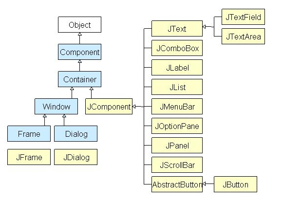
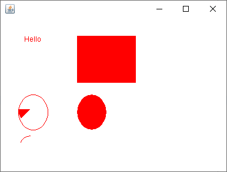

# Java Swing - Graphics2D

### 1. Java Swing:
Java Swing là cách gọi rút gọn khi người ta nhắc đến Swing của Java Foundation (JFC). Nó là bộ công cụ GUI mà Sun Microsystems phát triển để xây dựng các ứng dụng tối ưu dùng cho window (bao gồm các thành phần như nút, thanh cuộn,…).

Swing được xây dựng trên AWT API và hoàn toàn được viết bằng Java. Tuy nhiên, nó lại khác với AWT ở chỗ bộ công cụ này thuộc loại nền tảng độc lập, bao gồm các thành phần nhẹ và phức tạp hơn AWT.



Chú thích: Tất cả các thành phần trong swing được kế thừa từ lớp Jcomponent như JButton, JComboBox, JList, JLabel đều có thể được thêm vào lớp Container.

`Container` là các window như Frame và Dialog. Các container này chỉ có thể thêm một thành phần vào chính nó.

Các gói javax.swing bao gồm các lớp cho Java Swing API như JMenu, JButton, JTextField, JRadioButton, JColorChooser,…

Việc xây dựng ứng dụng sẽ trở nên dễ dàng hơn với Java Swing vì chúng ta có các bộ công cụ GUI giúp đỡ công việc.

### 2. JFrame, JButton, JLabel, JTextField, JTable, JList
#### 2.1 JFrame:
```Java
JFrame frame = new JFrame("Title");


frame.setDefaultCloseOperation();
```
- JFrame.DO_NOTHING_ON_CLOSE– Không làm thêm bất cứ điều gì khi JFrame bị đóng.
- JFrame.HIDE_ON_CLOSE – JFrame sẽ bị ẩn đi khi người dùng đóng nó lại. Chương trình vẫn sẽ hoạt động bình thường trong khi JFrame này bị ẩn. Đây là một hành động mặc định của JFrame.
- JFrame.DISPOSE_ON_CLOSE – Sau khi bị đóng lại, nó đồng thời sẽ bị dọn dẹp rác, các tài nguyên được JFrame này sử dụng sẽ bị thu hồi nhường chỗ cho những nơi khác sử dụng.
- JFrame.EXIT_ON_CLOSE – Sau khi JFrame bị đóng, chương trình cũng sẽ tắt theo.

```Java
frame.setSize(width, height);
frame.setLocation(int x, int y);
frame.setBounds(int x, int y, int width, int height);
frame.setLayout(new LayoutManager())**;

frame.setResizable(true / false);
frame.setIconImage(image.getImage());
frame.getContentPane().setBackground(new Color(0,0,0));
frame.add(component);
frame.pack(); //Bao gọn những thành phần đang có
frame.setSize(500,500);
frame.setVisible(true / false);
```

#### 2.1 JButton:
```Java
public class MyFrame extends JFrame implements ActionListener{
    
    JButton button;

    MyFrame(){
        button = new JButton();
        button.setBounds(200,100,100,50);
        button.addActionListener(this);
        button.setText("...");
        button.setFocusable(false);
        button.setBorder(BorderFactory.create...);
       
//      button.addActionListener(e -> sout("poo")); (ko cần implements AL);
        this.setDefaultCloseOperation(JFrame.EXIT_ON_CLOSE);
        this.setLayout(null);
        this.add(button);
        this.pack();
        this.setVisible(true);
    }
    
    @Override
    public void actionPerformed(ActionEvent e)
    {
        if(e.getSource == button)
        {
            Sysout.out.println("AloAlo");
            button.setEnabled(false);
        }
    }
}
```

#### 2.2 JLabel:
```Java
    JLabel label = new JLabel();
    label.setText("AloAlo");
    label.setIcon(image);
    label.setHorizontalTextPosition(JLabel.CENTER);
    label.setVerticalTextPosition(JLabel.TOP);
    label.setForeground(new Color(...));
    label.setFont(new Font("MV Boli", Font.PLAIN, 20));
    label.setIconTextGap(-1);
    label.setBackground(Color.black);
    label.setOpaque(true); //display background color;
    label.setHorizontalAlignment(JLabel.CENTER);
    label.setVerticalAlignment(JLabel.CENTER);

```
#### 2.3 JTextField
```Java
public class MyFrame extends JFrame implements ActionListener{
    
    JTextField textField;
    JButton button;

    MyFrame(){
        button = new JButton("Send");
        textField = new JTextField();
        textField.setPreferredSize(new Dimension(250,40));
        
       
//      button.addActionListener(e -> sout("poo")); (ko cần implements AL);
        this.setDefaultCloseOperation(JFrame.EXIT_ON_CLOSE);
        this.setLayout(null);
        this.add(button);
        this.add(textField);
        this.pack();
        this.setVisible(true);
    }
    
    @Override
    public void actionPerformed(ActionEvent e)
    {
        if(e.getSource == button)
        {
            Sysout.out.println("Hello " + textField.getText());
            button.setEnabled(false);
            textField.setEditable(false);
        }
    }
}
```

#### 2.4 JTable
```Java
    JTable table = new JTable(4,2); //4 rows, 2 columns
    table.setValueAt("AloAlo",0,0);
    table.setValueAt("YesSir",1,0);
```

#### 2.5 JList
```Java
JList() – Tạo JList rỗng.
JList(E[] items) – Tạo một JList với các phần tử items được chỉ định trong mảng.
JList(ListModel model) – Tạo một JList với Model được chỉ định sẵn.
JList(Vector items) – Tạo một JList với các phần tử items được chỉ định trong Vector.

Một số hàm thường xuyên sử dụng trong JList:

getSelectedIndex() – Trả về vị trí của phần tử đang được chọn.
getSelectedValue() – Trả về giá trị của phần tử đang được chọn.
setSelectedIndex(int i) – Chọn phần tử tại vị trí i.
setSelectionBackground(Color c) – Thay đổi màu nền của phần tử đang được chọn.
setSelectionForeground(Color c) – Thay đổi màu chữ của phần tử đang được chọn.
setListData(E [ ] l) – Đặt danh sách các phần tử mới trong mảng vào JList, các phần tử đang tồn tại trong Jlist sẽ bị thay thế.
setVisibleRowCount(int v) – Thay đổi visibleRowCount.
setSelectedValue(Object a, boolean s) – Chọn phần tử dựa vào giá trị.
setListData(Vector l) – Đặt danh sách các phần tử mới trong vector vào JList, các phần tử đang tồn tại trong Jlist sẽ bị thay thế.
getSelectedValuesList() – Trả về danh sách các phần tử đang được chọn.
getMinSelectionIndex() – Trả về vị trí nhỏ nhất của phần tử được chọn, -1 nếu không có phần tử nào được chọn.
getMaxSelectionIndex() – Trả về vị trí lớn nhất của phần tử được chọn, -1 nếu không có phần tử nào được chọn.
getLastVisibleIndex() – Trả về vị trí lớn nhất của phần tử trong JList.
```

### 3. BorderLayout, FlowLayout, GridLayout

- **BorderLayout:** Đặt các thành phần ở tối đa 5 vị trí: 
  - Là bố cục mặc định của `JFrame`.
  - BorderLayout.NORTH / SOUTH / EAST / WEST / CENTER.
```Java
  frame.setLayout(new BorderLayout(int margin left - right, int margin top - bottom));
  e.g: frame.getContentPane().add(component, BorderLayout.NORTH);
```
- **FlowLayout:** Bố cục này đặt các thành phần lần lượt vào một hàng, nếu thiếu chỗ sẽ tự bù xuống dòng dưới.
  - Là bố cục mặc định của `JPanel`.
  - FlowLayout.LEADING / CENTER / TRAILING: dịch trái / giữa / phải.
```Java
  frame.setLayout(new FlowLayout(FlowLayout.CENTER, int margin left-right, int margin top-bottom));
```
- **GridLayout:** Bố cục này chia cửa sổ thành dạng lưới (Grid), các ô có kích thước như nhau.
```Java
  frame.setLayout(new GridLayout(int row, int column, int margin left-right, int margin top-bottom));
```

### 4. Graphics2D, Image
```Java
import java.awt.Canvas;
import java.awt.Color;
import java.awt.Graphics;
 
import javax.swing.JFrame;
 
public class DisplayGraphics extends Canvas {
    public void paint(Graphics g) {
        g.drawString("Hello", 40, 40);
        setBackground(Color.WHITE);
        g.fillRect(130, 30, 100, 80);
        g.drawOval(30, 130, 50, 60);
        setForeground(Color.RED);
        g.fillOval(130, 130, 50, 60);
        g.drawArc(30, 200, 40, 50, 90, 60);
        g.fillArc(30, 130, 40, 50, 180, 40);
 
    }
 
    public static void main(String[] args) {
        DisplayGraphics m = new DisplayGraphics();
        JFrame f = new JFrame();
        f.add(m);
        f.setSize(400, 300);
        f.setVisible(true);
    }
} 
```
